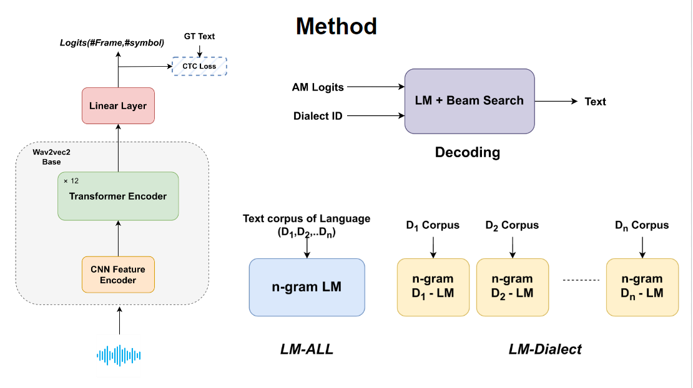

## Abstract
We present an end-to-end Automatic Speech Recognition (ASR) system in the context of the recent challenge tasks for Bhojpuri and Bengali. Our implementation follows the currently popular **wav2vec2 models* while we investigate ways to leverage the dialect-categorised data in order to improve ASR performance. We report overall improvements in word error rate with dialect-specific language models for each of the languages. We present an analysis that provides insights into some of the factors underlying the success of dialect-specific language models. [Paper](https://doi.org/10.1007/978-3-031-48309-7_5)

## Method


## Requirements
```bash
pip install .
wget -O - https://kheafield.com/code/kenlm.tar.gz | tar xz
mkdir kenlm/build && cd kenlm/build && cmake .. && make -j2
```

## Preprocessing

To get the speech and corresponding transcript from the dataset and convert into the Huggigface-Dataset format:
```bash
python pre_processing.py \
  --repo_name "Trained_Model/wav2vec2-bh" \
  --path "Dataset/bh" \
  --dev_path "Dataset/bh/bh_dev/dev" \
  --train_text_path "MADASR-Competition/RESPIN_ASRU_Challenge_2023/corpus/bh/train/text" \
  --dev_text_path "MADASR-Competition/RESPIN_ASRU_Challenge_2023/corpus/bh/dev/text" \
  --dataset_name "bh_processed" \
  --vocab_path "Vocab/vocab_bh.json"
```

To Create the Dialect ID based Dataset for Evaluation:
```bash
python eval_dialect_dataset.py \
  --dev_path "/home/raj/Lab/Dataset/bh/bh_dev/dev" \
  --utt2lang_path "RESPIN_ASRU_Challenge_2023/corpus/bh/dev/utt2lang" \
  --dev_text_path "RESPIN_ASRU_Challenge_2023/corpus/bh/dev/text" \
  --processor_name "Trained_Model/wav2vec2-bh" \
  --dataset_name "Dataset/bh_dev_dialect"
```


## Acoustic Model (AM) Training
```bash
python train_AM.py --config_path="Config/train_AM.yaml"
```

## Language Model (LM) Training
```bash
python train_LM-All.py --config_path="Config/train_LM-All.yaml"
python train_LM_Dialect.py --config_path='Config/train_LM-Dialect.yaml'
```

## Evaluation
```bash
python test_AM.py --config_path="Config/test_AM.yaml"
python test_AM_LM-All.py --config_path="Config/test_AM_LM-All.yaml"
python test_AM_LM-Dialect.py --config_path="Config/test_AM_LM-Dialect.yaml"
```

## Inference
To run the model for one speech audio, you can use the notebook below.

 [Notebook](Notebook/inference.ipynb)

## Results
All the results below are in WER (Word Error Rate).

### Overall Performance across Dialect in different systems:
| Model                | Bengali | Bhojpuri |
|----------------------|---------|----------|
| AM                   | 21.8    | 21.21    |
| AM + 5 gram LM-All   | 16.04   | 16.76    |
| AM + 5 gram LM-Dialect| **15.62**   | 16.48    |
| AM + 6 gram LM-All   | 16.06   | 16.67    |
| AM + 6 gram LM-Dialect| 15.68   | **16.26**    |


### Bhojpuri Language:
| Dialect/Model         | AM    | AM + 6 gram LM-All | AM + 6 gram LM-Dialect |
|-----------------------|-------|--------------------|------------------------|
| D1                    | 20.56 | 14.90              | 14.70                  |
| D2                    | 20.89 | 16.00              | 15.80                  |
| D3                    | 21.97 | 18.59              | 17.88                  |
| All                   | 21.21 | 16.67              | 16.26                  |


### Bengali Language:
| Dialect/Model          | AM    | AM + 5 gram LM-All | AM + 5 gram LM-Dialect |
|------------------------|-------|--------------------|------------------------|
| D1                     | 19.76 | 15.02              | 14.02                  |
| D2                     | 21.44 | 16.08              | 15.60                  |
| D3                     | 18.40 | 14.44              | 13.93                  |
| D4                     | 20.71 | 16.21              | 15.73                  |
| D5                     | 27.90 | 18.19              | 18.15                  |
| All                    | 21.21 | 16.04              | 15.62                  |

## Contact
If you have any questions, please feel free to contact me at: [LinkedIn](https://www.linkedin.com/in/raj-gothi-191246187/),[Email](mailto:rajgothi6@gmail.com)

## Citation
If you are using this code, please cite it as follows.

```bibtex
@InProceedings{10.1007/978-3-031-48309-7_5,
author="Gothi, Raj
and Rao, Preeti",
title="Improving Automatic Speech Recognition with Dialect-Specific Language Models",
booktitle="Speech and Computer",
year="2023",
publisher="Springer Nature Switzerland",
address="Cham",
pages="57--67",
}
```
 
